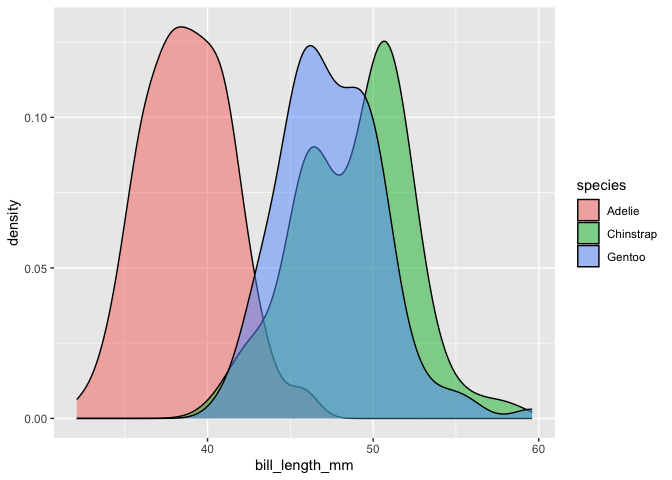
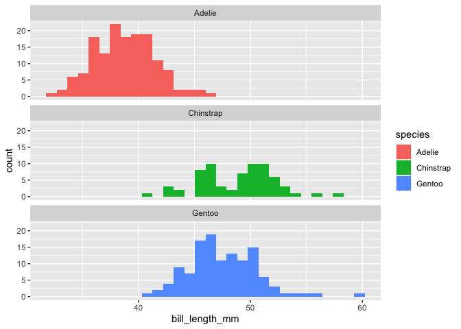
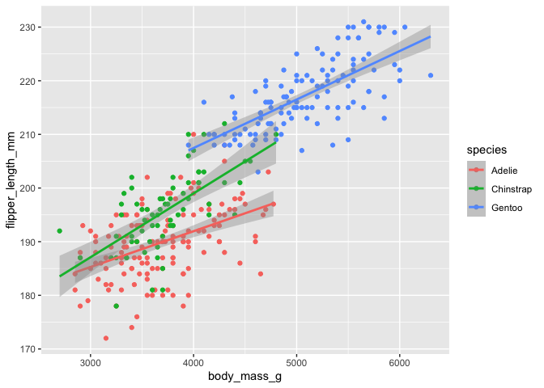
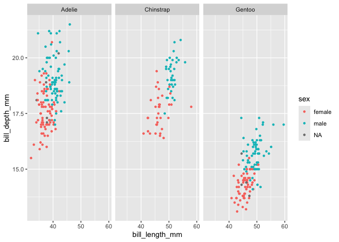
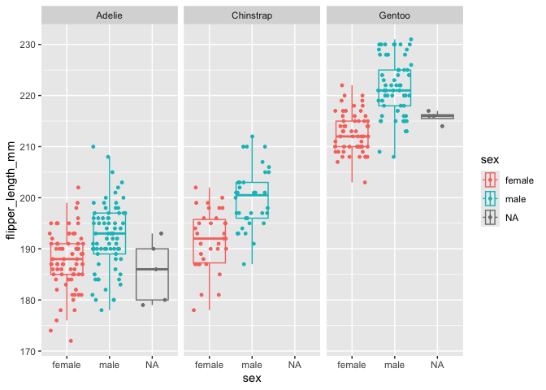

All About Penguins!
================
A webiste by Will Hooker

 Today, we’ll use
ggplot to visually explore patterns in morphological traits in three
different species of penguin. This data were collected and made
available by Dr. Kristen Gorman and the Palmer Station, Antarctica LTER,
and were compiled by Dr. Allison Horst and colleagues.

 

## Data

Below is a summary of the penguin data used for the following analyses:

 

    ##       species          island    bill_length_mm  bill_depth_mm  
    ##  Adelie   :152   Biscoe   :168   Min.   :32.10   Min.   :13.10  
    ##  Chinstrap: 68   Dream    :124   1st Qu.:39.23   1st Qu.:15.60  
    ##  Gentoo   :124   Torgersen: 52   Median :44.45   Median :17.30  
    ##                                  Mean   :43.92   Mean   :17.15  
    ##                                  3rd Qu.:48.50   3rd Qu.:18.70  
    ##                                  Max.   :59.60   Max.   :21.50  
    ##                                  NA's   :2       NA's   :2      
    ##  flipper_length_mm  body_mass_g       sex           year     
    ##  Min.   :172.0     Min.   :2700   female:165   Min.   :2007  
    ##  1st Qu.:190.0     1st Qu.:3550   male  :168   1st Qu.:2007  
    ##  Median :197.0     Median :4050   NA's  : 11   Median :2008  
    ##  Mean   :200.9     Mean   :4202                Mean   :2008  
    ##  3rd Qu.:213.0     3rd Qu.:4750                3rd Qu.:2009  
    ##  Max.   :231.0     Max.   :6300                Max.   :2009  
    ##  NA's   :2         NA's   :2

 

## Single trait distribution

This section explores single morphological traits in penguins. For
example, bill length per species can be plotted:

 

 

## Relationship between multiple traits

This section explores the relationship between different morphological
traits in penguins. For example, the relationship between body mass and
flipper length can be plotted:

 

 

## Sexual dimorphism

This section explores the level of sexual dimorphism in different
morphological traits. For example, what traits are sexually dimorphic in
penguins?

 

